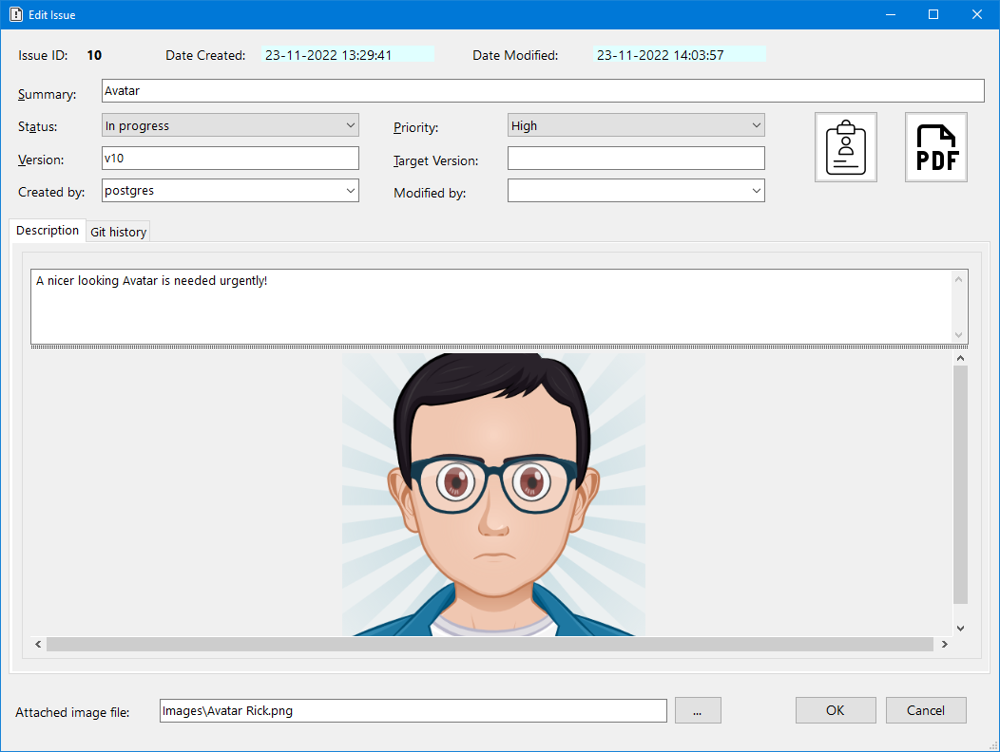

# MaxiBug - Issue Tracker and To-do List

This is a fork of MiniBug2 for VS2022 and .NET 4.8.

Some of the changes:
- Uses a PostgreSQL database

------------------------------------
MaxiBug is a simple issue tracker and to-do list, it is a Windows desktop multi-user application. 
 

MaxiBug uses a Postgres database (9.4 or higher) to store data.

Attached images are stored in the database.

When using the "Copy to clipboard" button, text and images can be pasted into office applications by using "Paste special".

## Features

- Issues: create, edit, delete, clone
- Tasks: create, edit, delete, clone
- Show/hide/sort columns
- Some user defined settings
- Export issues and tasks to CSV format

# Getting Started

For security reasons, PostgreSQL does not listen on all available IP addresses on the server machine initially. 
In order to access the server over the network, you need to enable listening on the address first. 

For PostgreSQL servers starting with version 8.0, this is controlled using the **listen_addresses** parameter in the data\postgresql.conf file. 
Here, you can enter a list of IP addresses the server should listen on, or simply use '*' to listen on all available IP addresses.
Also see: https://www.postgresql.org/docs/current/runtime-config-connection.html

If your Postgres server is exposed to the internet the default user and password should be changed and Postgres should preferably be using a non-default port.
As MaxiBug does not offer user authentication itself, the users and their passwords should be managed in Postgres.
In the MaxiBug settings the connection settings for a user can be configured.

For testing purposes a [portable version of PostgreSQL](https://github.com/garethflowers/postgresql-portable) can be downloaded.

## Prerequisites

- Microsoft Windows 7 or higher
- Microsoft .NET Framework 4.8

# How To Use

First you need to create a new project (File > New Project), define a project name and choose a location to save it:

Next you can start adding issues and tasks:
- issues are bugs/problems
- tasks are items in a to-do list

## Issues

## Tasks

## Settings

The user can modify some settings (File > Settings) in order to customize the look and feel of the application:

Settings in action:

## Sorting

You can sort the grid rows in two ways:

- by clicking on a column header:

- by using the **Configure Columns** window:

Using the second method you can sort by up to two columns and with different criteria (ascending or descending).

## Column visibility

You can show/hide any column (except the **ID** column, which is always visible), using the **Configure Columns** window:

## Exporting

You can export a project's issues and tasks to CSV (comma separated values) files:

Because issues and tasks have a slightly different structure, they are exported to separate files. If a project only has issues or tasks, only one file will be generated:

# License

This project is licensed under the MIT License - see the LICENSE.md file for details.

# Acknowledgments

This project uses the following libraries:

- <a href="https://www.newtonsoft.com/json">Json.NET</a>: for reading/writing to .json files
- <a href="https://joshclose.github.io/CsvHelper/">CsvHelper</a>: for exporting to CSV
- <a href="https://www.codeproject.com/Articles/5299801/A-Control-to-Display-Pie-and-Doughtnut-Charts-with">Pie chart control</a>: by Angelo Cresta
- <a href="https://www.codeproject.com/Articles/570682/PDF-File-Writer-Csharp-Class-Library-Version-2-0-0">PdfFileWriter library</a>: by Uzi Granot
- <a href="https://github.com/Fody/Costura">Fody.Costura</a>: for creating a single exe

<a target="_blank" href="https://icons8.com/icon/EQ4HGAcEI0hH/chart">Chart</a>, 
<a target="_blank" href="https://icons8.com/icon/9u9JUlsiUlgh/clipboard">Clipboard</a>, 
<a target="_blank" href="https://icons8.com/icon/57857/pdf">PDF</a> and Filter icon by <a target="_blank" href="https://icons8.com">Icons8</a>
