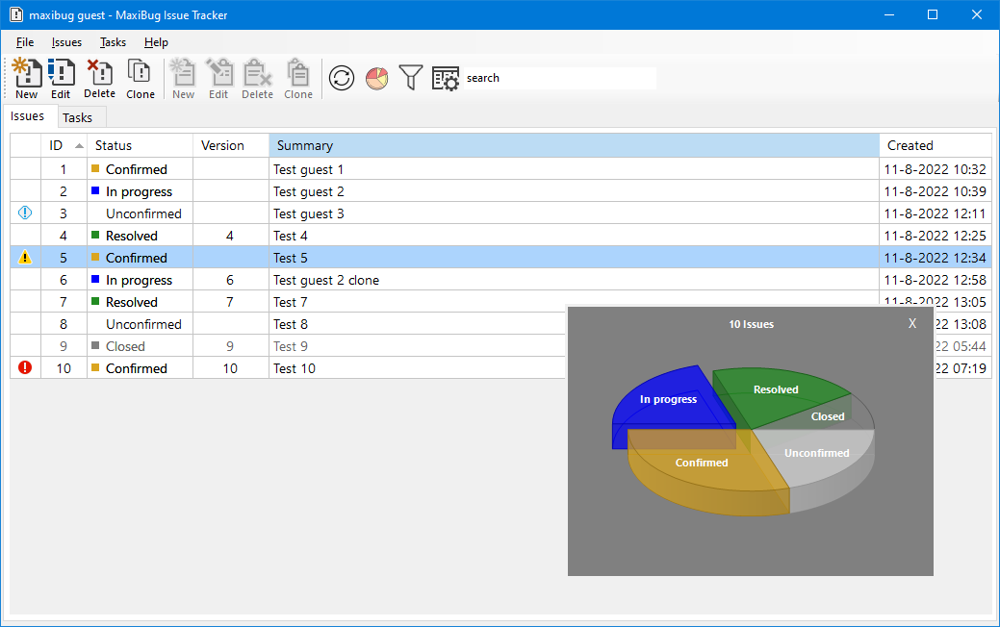
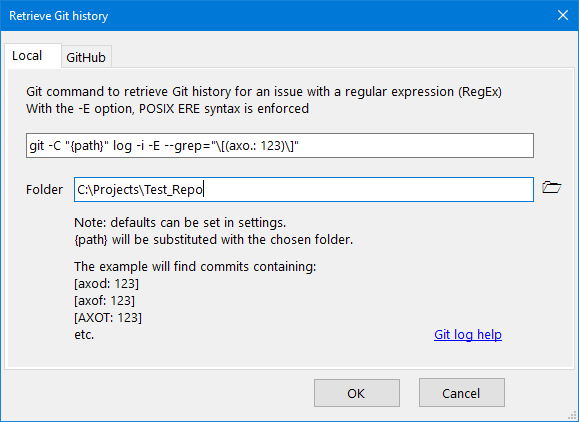
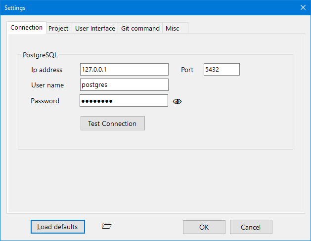

# MaxiBug - Issue Tracker and To-do List

This is a fork of [MiniBug2](https://github.com/RickZeeland/MiniBug-2) for VS2022 and .NET 4.8.

Some of the changes:
- Multi-user instead of single-user
- Uses a PostgreSQL database
- Git support

------------------------------------
MaxiBug is a simple issue tracker and to-do list, it is a Windows desktop multi-user application. 
 

MaxiBug uses a Postgres database (9.4 or higher) to store data.

An image can be attached to an issue, drag & drop is also supported.
Attached images are stored in the database.

When using the "Copy to clipboard" button, text and images can be pasted into office applications by using "Paste special".

## Benchmarks

Tested on a Windows 10 machine with PostgreSQL 14 and an SSD.
For a database with 4000 issues the first loading time will be about 1.5 seconds and subsequent application starts will be faster.
As Postgres caches data, testing gives varied results.

## Features

- Issues: create, edit, delete, clone
- Tasks: create, edit, delete, clone
- Show/hide/sort columns
- Some user defined settings
- Export issues and tasks to CSV format

## Class diagram

An overview of the main classes and enumerations:

(note: to open the diagram in Visual Studio you must have the "Class diagram" option enabled in the VS installer)

# Getting Started

For security reasons, PostgreSQL does not listen on all available IP addresses on the server machine initially. 
In order to access the server over the network, you need to enable listening on the address first. 

For PostgreSQL servers starting with version 8.0, this is controlled using the **listen_addresses** parameter in the data\postgresql.conf file. 
Here, you can enter a list of IP addresses the server should listen on, or simply use '*' to listen on all available IP addresses.
Also see: https://www.postgresql.org/docs/current/runtime-config-connection.html

If your Postgres server is exposed to the internet the default user and password should be changed and Postgres should preferably be using a non-default port.

As MaxiBug does not offer user authentication itself, the users and their passwords should be managed in Postgres.

See: [How to Create User in PostgreSQL (Postgres) Using PgAdmin](https://www.guru99.com/postgresql-create-alter-add-user.html).

In the MaxiBug settings the connection settings for a user can be configured.
Although multiple users can login with the same user name, this is not recommended. 

For testing purposes a [portable version of PostgreSQL](https://github.com/garethflowers/postgresql-portable) can be downloaded.

Another option would be to use a Postgres hosting provider like [Heroku](https://www.heroku.com/postgres) as mentioned in this [C# Corner article](https://www.c-sharpcorner.com/article/configuration-postgresql-database-on-heroku/).
I tried to get the free Postgres option working, but without success.

## Prerequisites

- Microsoft Windows 7 or higher
- Microsoft .NET Framework 4.8
- [PostgreSQL 9.4 or higher](https://www.postgresql.org/)

# How To Use

First set the Postgres user name and password in the Settings screen.
If the user has the rights to create a database, create a new project (File > New Project), by defining a project name and database name:

Next you can start adding issues and tasks:
- issues are bugs/problems
- tasks are items in a to-do list

## Issues

Note: it's possible to jump to other issues by double-clicking on an issue number in the description field.  

By selecting the "Git history" tab and pressing the sync button at the bottom-right, the Git history for an issue can be retrieved.  
This will only work if Git for Windows is installed and a working copy of the repository is present on your system.  

Example git command to search in commit messages (can also be executed from DOS):  

  git -C "C:\Projects\Test_Repo" log -i -E --grep="\[(axo.: 10)\]"  

Example git command to search in tags:

  git -C "C:\Projects\Test_Repo" tag --list "Release*"

Clicking the [Git log help](https://git-scm.com/docs/git-log) link will open the browser with the Git log help page.

## Tasks

## Settings

The user can modify the settings (File > Settings) for the Postgres connection:

Change the project name:

Customize the look and feel of the application:

Change some other settings:

Settings in action:

## Sorting

The videos below are from the original MiniBug application and look slightly different in MaxiBug.

You can sort the grid rows in two ways:

- by clicking on a column header:

- by using the **Configure Columns** window:

Using the second method you can sort by up to two columns and with different criteria (ascending or descending).

## Column visibility

You can show/hide any column (except the **ID** column, which is always visible), using the **Configure Columns** window:

## Exporting

You can export a project's issues and tasks to CSV (comma separated values) files:

Because issues and tasks have a slightly different structure, they are exported to separate files. If a project only has issues or tasks, only one file will be generated:

# License

This project is licensed under the MIT License - see the LICENSE.md file for details.

# Acknowledgments

This project uses the following libraries:

- <a href="https://www.npgsql.org/">NpgSql</a>: .NET Data Provider for PostgreSQL
- <a href="https://www.newtonsoft.com/json">Json.NET</a>: for reading/writing to .json files
- <a href="https://joshclose.github.io/CsvHelper/">CsvHelper</a>: for exporting to CSV
- <a href="https://www.codeproject.com/Articles/5299801/A-Control-to-Display-Pie-and-Doughtnut-Charts-with">Pie chart control</a>: by Angelo Cresta
- <a href="https://www.codeproject.com/Articles/570682/PDF-File-Writer-Csharp-Class-Library-Version-2-0-0">PdfFileWriter library</a>: by Uzi Granot
- <a href="https://github.com/Fody/Costura">Fody.Costura</a>: for creating a single exe

<a target="_blank" href="https://icons8.com/icon/EQ4HGAcEI0hH/chart">Chart</a>, 
<a target="_blank" href="https://icons8.com/icon/9u9JUlsiUlgh/clipboard">Clipboard</a>, 
<a target="_blank" href="https://icons8.com/icon/33936/sync">Sync</a>, 
<a target="_blank" href="https://icons8.com/icon/57857/pdf">PDF</a> and Filter icon by <a target="_blank" href="https://icons8.com">Icons8</a>
